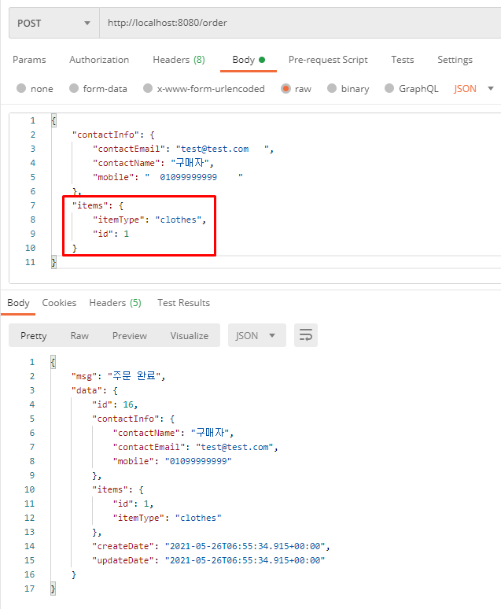
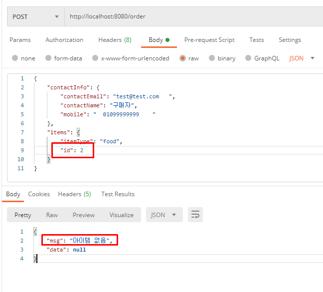

# 알레시오 쇼핑몰 api 구현

안녕하세요. 
진경빈입니다.  

# 목차
- 개발 환경
- 의존성
- 실행 방법
- 기능
- API
- H2 접속 정보

# 개발 환경
- 개발언어 : JAVA SpringBoot - 2.4.5V
- IDE : STS
- DB : H2
- WAS : Tomcat

# 의존성 
- JPA
- spring devtool 
- H2 DB
- Lombok 
- Validation 
- AOP 

# 기능 
- food, clothes 두가지 주문가능
- food 
   - 물건 10개 미만시 입고요청(중복 입고요청 X)
   - 물건 0개 이하시 재고없습니다 msg 반환
   - 입고요청값 암호화
- clothes
  -    food와 같은 기능
-  배치 프로그램
   -  Exception
      - 에러 발생시 에러리스트에 에러저장
   - 1분마다 에러리스트의 값을 DB에 일괄 저장
- AOP
   - Vaild 체크 
     - Vaild 에러 발생시 에러리스트에 저장
- Junit5
   - FrontController 테스트
  
  

# API

### POST
요청주소 : http://localhost:8080/order

### 기본 요청 주문 요청

#### Food

 
 

#### Clothes

 
 

#### 재고 0개이하

 

#### 다른 아이디 

 
 

####  API 정보

  # H2 접속 정보 

- JDBC URL : jdbc:h2:mem:h2db
- User Name : alethio
- Password : admin 
